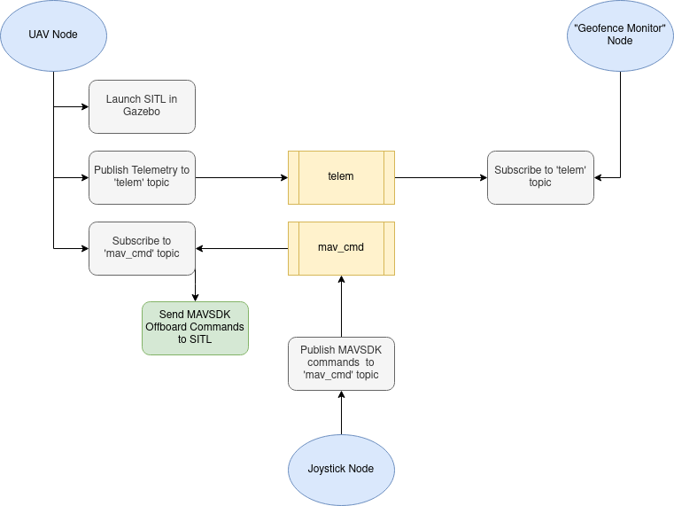

 
# SOAR Geofence Gazebo

Team Members:
- Dowon Lee, dowonlee@buffalo.edu
- Dylan Czubak, dylanczu@buffalo.edu

--- 

## Project Objective

This course project is motivated by SOAR, an outdoor facility for drone research. It is a netted enclsoure allowing for both autonomous and manual flight. Although the netting prevents drones from escaping the facility, it would be ideal to prevent a drone from ever hitting the net resulting in getting stuck or a crash to the floor. The open source drone autopilots such as PX4 and ArduPilot have geofence functionality but seems to only implement failsafes (hold, return to home) once a breach occurs. We aim to implement geofence logic that identifies if a drone's thrust and trajectory will exceed the encolsure. The drone will be redirected along the boundary of the geofence, based on the angle of its approach. In testing of our logic, we will control a simulated drone with an Xbox controller. This is representative of a real use case in SOAR, and would allow for inexperienced pilots and even guests at the facility to fly safely.

Similarly, we will also implement a low altitude boundary to ensure a drone does not crash in the middle of a flight (This must be switched off when a land command is given).

We will leverage ROS to share information between the SITL, joystick controller and geofence monitor nodes. The planned framework is roughly scripted in the flowchart below.

## Contributions
- Proactive geofence logic

## Project Plan
{How will we do it?  What resources will we use (e.g., specific online materials, specific chapters from the textbook, etc.)?}

## Milestones/Schedule Checklist
{What are the tasks that you need to complete?  Who is going to do them?  When will they be completed?}
- [x] Complete this proposal document.  *Due Nov. 2*
- [x] Research into suspected future problems or topics not covered in class 
- [ ] Custom SOAR Gazebo Model, DC
  - [ ] Create Main Poles x13
    - [ ] Correct Color, Location, & Size
  - [ ] Lights x2
    - [ ] Using light id: 1 as the origin of the model, with everything built off this dimension wise
  - [ ] Generate ground potentially pulled from Open Maps
  - [ ] If it makes sense also add the three grass mounds
- [ ] Setting up Gazebo Sim and PX4 SITL
    - [x] Installation of PX4-Autopilot and mavsdk-Python. See README.md
    - [ ] Write separate shell script from PX4's `sitl_run.sh` (tailored to our needs) to launch Gazebo and PX4 SITL.
- [ ] `Uav.py` node
    - [ ] Connect to running PX4 SITL
    - [ ] Takeoff, land
    - [ ] Create `telemetry` thread and publish to `telem` topic
    - [ ] Implement Offboard Mode
        - [ ] Implement offboard functions in response to `joystick.py` node.
        - [ ] Implement overriding of offboard functions in response to `geofence_monitor.py` node.
- [ ] `joystick.py` node
    - [ ] Borrow code from `optimatorlab/m3c_wg`
    - [ ] Refine mappings if necessary and publish to `mav_cmd` topic
- [ ] `geofence_monitor.py` node
    - [ ] Identify if the drone flight and given `mav_cmd` will cause it to exceed the geofence
    - [ ] Send the overriding `mav_cmds` if necessary to make drone slide across geofence, or prevent altitude (rise/sink)

- [ ] Create progress report.  *Due Nov. 20*
- [ ] Necessary changes found due to errors arised during progress update 
- [ ] Create final presentation.  *Due Dec. 4*
- [ ] Provide system documentation (README.md).  *Due Dec. 14*

## Measures of Success
{How will you know you succeeded?  If you were to receive partial credit, what should we look for?}

---
**A Sample Proposal Appears Below**
---

# Creating a Gazebo Model of the Duckiebot

Team Members:
- Chase Murray, cmurray3@buffalo.edu
- Jane Student, j@buffalo.edu

## Project Objective
The goal of this project is to create a Gazebo model of the Duckiebot. This model will accurately reflect the dimensions of the Duckiebot, will include the Duckiebot's sensors (a fisheye lens camera and a magnetometer), and will have the same drive train (two motors controlling the two motorized wheels).

## Contributions
There are currently no Gazebo models of this robot.  By creating such a model, we will be able to test control algorithms in a simulated environment (without the need for the physical robot itself).  However, after training the control algorithms in Gazebo, it will be easy to execute them on a real Duckiebot, since the simulated version will be an accurate representation.

## Project Plan
The textbook contains two chapters (Chapters 15--17) that describe how to build a custom robot.
However, these chapters do not discuss the use of a fisheye lens.  We will use the ros.org Website to learn how to model such cameras.
We will also consult the Duckiebot specs to determine the dimensions and weight of the robot, as well as the capabilities of the motors.

## Milestones/Schedule Checklist
- [x] Complete this proposal document.  *Due Nov. 2*
- [ ] Capture the specs of the actual/physical robot.  *JS, Nov. 13*
- [ ] Build a sample model using the textbook examples. *CM, Nov. 13*
- [ ] Modify the sample model to match the specs of the Duckiebot.  *CM, Nov. 17*
- [ ] Add a fisheye lens camera. *JS, Nov. 18*
- [ ] Create progress report.  *Due Nov. 20*
- [ ] Create Gazebo .launch files to test the robot.  *CM, Dec. 1*
- [ ] Create a simple controller to test the interaction with the robot. *JS, Dec. 3*
- [ ] Create final presentation.  *Due Dec. 4*
- [ ] Update documentation based on presentation feedback. *CM, Dec. 7*
- [ ] Provide system documentation (README.md).  *Due Dec. 14*

## Measures of Success
- [ ] View robot model in Gazebo.
- [ ] Demonstrate that the fisheye lens camera is appropriately distorted.
- [ ] Demonstrate that robot moves when given commands.
- [ ] Implement code on a real Duckiebot.
- [ ] Have a classmate follow the steps in the README to successfully run the simulation without any help.

