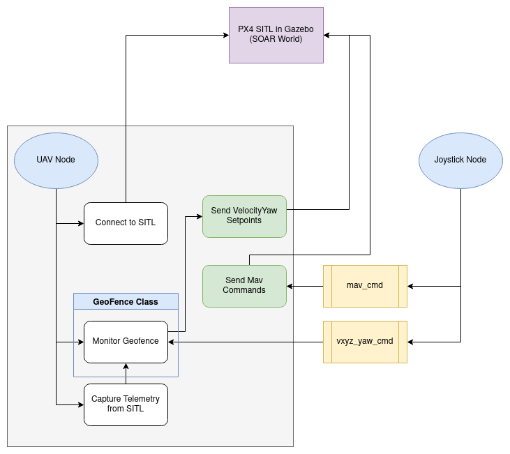
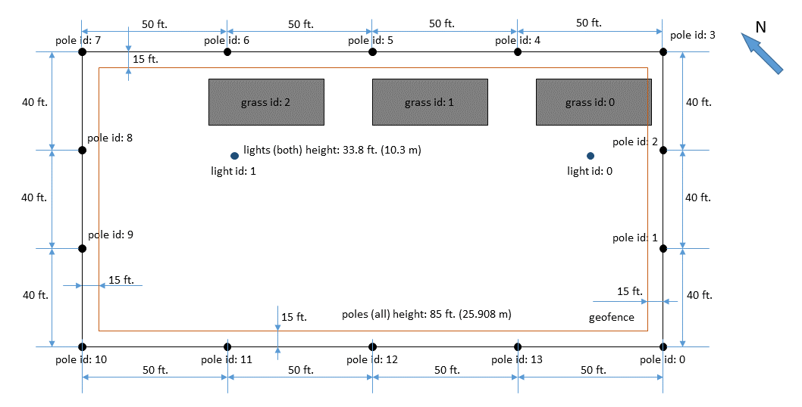
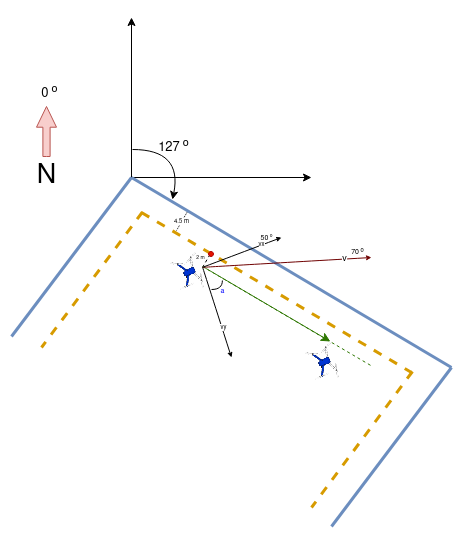

# SOAR Geofence Gazebo

Project Name: `soar_geofence`

Team Members:
- Dowon Lee, dowonlee@buffalo.edu
- Dylan Czubak, dylanczu@buffalo.edu

## Project Description

Our project provides the means to fly a drone in the SOAR facility manually, using a joystick (PlayStation or Xbox controller) with minimal risk of crashing into the netted enclosure as well as the ground. To develop this we leveraged the PX4 autopilot's SITL (Software-in-the-Loop) and their Gazebo simulation. 

The framework below is different from what was proposed as we began to understand how to implement this project. It consists of three major components, the PX4 SITL in Gazebo, and the ROS nodes `UAV` and `Joystick`. 



While we use PX4's SITL in a Gazebo simulation, we created and use our own world, which is modeled after the SOAR facility. Details on how we built the world will be covered in the next section.

The SITL is waiting to be connected to, which our Python ROS node, `UAV` will do through `MAVSDK`. The `Joystisck` node connects to an available controller and publishes the signals at a rate of `2 hz` from the sticks to the `vyxyz_yaw_cmd` topic, which represents velocities in the x,y,z directions and yaw speed in m/s. The commands for starting `Offboard` Mode, taking off and landing are done through button signals published to a separate topic: `mav_cmd`.

The `Monitor Geofence` block takes in the most recent velocities and yaw message in addition to the telemetry (lat, lon), and runs the geofence logic before sending the command to the STIL, at a rate of `5 hz`. The specifics in the geofence logic are outlined in a separate section.

### Gazebo World

First, we created a Gazebo world of the SOAR facility. The dimensions of the pole placements can be seen in the image below, courtesy of SOAR's GitHub page: https://github.com/optimatorlab/SOAR



By default, the Gazebo simulator does not have a sense of an ellipsoidal earth and uses Cartesian coordinates (x,y,z). However, we can specify the latitude, longitude and MSL altitude at the origin of the Gazebo world, using the `<spherical_coordinates>` tag in the world file. We defined this origin as pole number `10`, in the diagram. The latitude, longitude and altitude of each pole is once again provided by SOAR's GitHub page. While we have now specified to Gazebo the geo-location of the origin, we could not place the poles by specifying their latitude and longitude. Thus, we needed to convert the change in latitdue and longitude of each pole from the origin, to `x` and `y` lengths in meters. Rather than using an estimation calculated using the radius of the Earth, we simply estimated the difference of latitude and longitude for a 1 meter offset in the `y` and `x` directions, respectively, in the Gazebo world. In order to do this, we leverage the telemetry reported by the PX4 SITL, which we are publishing to a ROS topic, named `telem`. By moving the drone 1 meter in both directions, we captured the latitude and longitude values reported by the SITL and calculated a constant conversion. This resulted in the rough estimates: 

|   |           Change per `1m` |
| -------   |  -------   |
| latitude |`0.0000088`  |
| longitude | `0.0000122`|

We used these constants to calculate the (x,y) positions of each pole.

### Geofence Logic

Our default geofence is defined by 4 coordinates that define an inner rectangle of SOAR, as seen in the dimension diagram from earlier. From these coordinates we define the fences. We assume the adjacent coordinates in the sequence given share an edge, or "fence". 




## Getting Started

This project requires and assumes ROS Noetic is installed in your system. Other required installations are listed below.

### MAVSDK

We use the MAVSDK-Python API to interface with the MAVLink enabled PX4 drone, specifically version `0.20.0`. Note that `Python 3.6+` is required.

```
pip3 install mavsdk==0.20.0
```

### PX4-Autopilot


- https://docs.px4.io/master/en/simulation/gazebo.html
- https://docs.px4.io/master/en/dev_setup/dev_env_linux_ubuntu.html#gazebo-jmavsim-and-nuttx-pixhawk-targets

Clone the repo in your HOME directory.
```
cd ~
git clone https://github.com/PX4/PX4-Autopilot.git --recursive
```
Run the following, this may take some time.
```
bash ./PX4-Autopilot/Tools/setup/ubuntu.sh
```

### soar_geofence

Clone our repo in your `Projects` directory:
```
cd ~/Projects
git clone https://github.com/dowonlee777/soar_geofence.git
```

Make sure `sitl.sh` is executable
```
cd soar_geofence/code/soar_geofence/scripts
chmod +x ./sitl.sh
```

### Catkin Workspace

Assumes you have a catkin workspace at `~/catkin_ws`.

Create our package once:
```
cd ~/catkin_ws/src
catkin_create_pkg soar_geofence
```
Copy and paste our `soar_geofence/code/soar_geofence` directory into the `~/catkin_ws/src` directory

```
cp -R ~/Projects/soar_geofence/code/geofence ~/catkin_ws/src
```
Build/make project:
```
cd ~/catkin_ws
catkin_make
```

### To Run

Have a joystick controller (Xbox 360) connected via USB.

Then run:

```
cd ~/catkin_ws/src/soar_geofence
./launch_soar_geofence.sh
```

--------------------------------------------------------------------------------------------------------------------------------------------------------

## Organizing your Repository
For consistency, please use the directory structure described below, where `projectname` should be replaced with the actual catkin_ws name of your project.
	
```
PROPOSAL.md
README.md
Images/	
code/projectname/	
	scripts/
	msg/
	srv/
	CMakeLists.txt
	package.xml
```		

- A sample README file [may be found here](README_template.md)
- `Images/` is a directory (folder) for storing the graphics for your README.
- `code/projectname/` is a directory for your ROS code.  Replace `projectname` with the name of your catkin package.
	- Within this directory you should have `CMakeLists.txt`, `package.xml`, a `scripts/` directory, most likely a `msg/` directory, and possibly a `srv/` directory (if your project uses services).  
- See `06_Followbot` for an example of the directory structure.


---

## Project Grading

Grades for the final project will be based on the following percentages and content:

- Proposal (15%)
- Progress Report (10%)
- Final Documentation and Code (50%)
	- Did you address issues from the presentation feedback?
	- How did you do on the "measures of success"?
	- Can the instructor successfully install the prereqs?
	- Can the instructor successfully run the code?  (I highly recommend that you find someone to test this for you)
	- Does the code do what it's supposed to?
- Project Demonstration (25%)
	- Did you prepare/rehearse for this presentation?
	- Is the README neatly formatted?
	- Is the README (nearly) complete?
	- Was the code submitted/organized properly?  Are filenames correct?  Code in the proper directories/subdirectories?
	- Are the installation instructions complete?
	- Are the instructions for running the code complete?
	- Were you able to answer technical questions about your project?
	- How well were you able to demonstrate the actual implementation?
